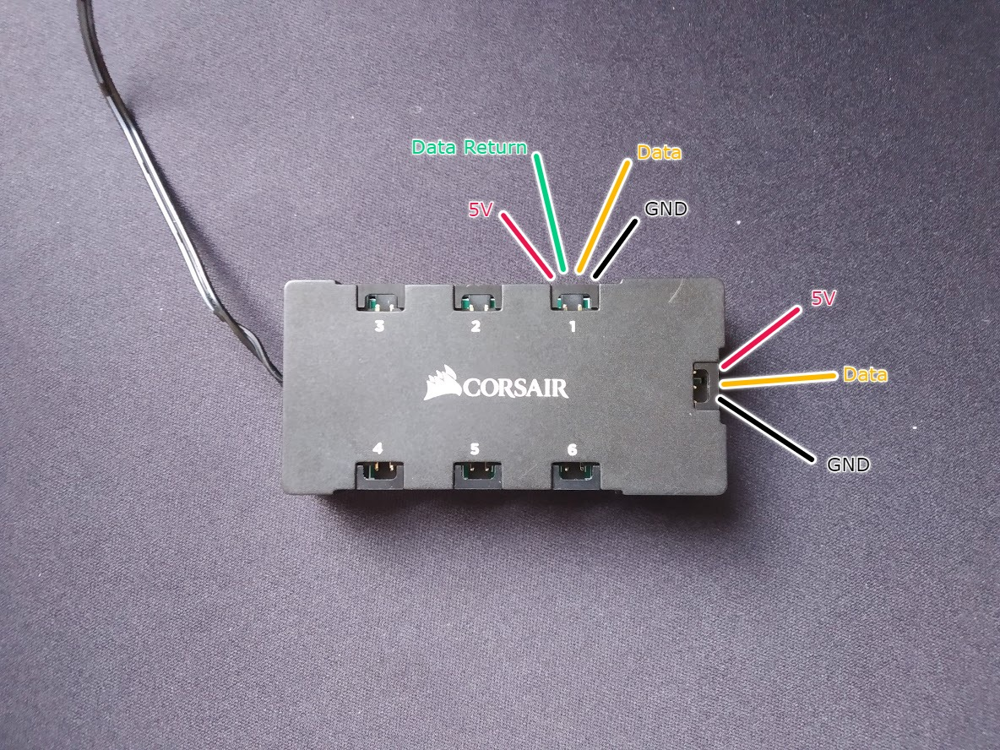
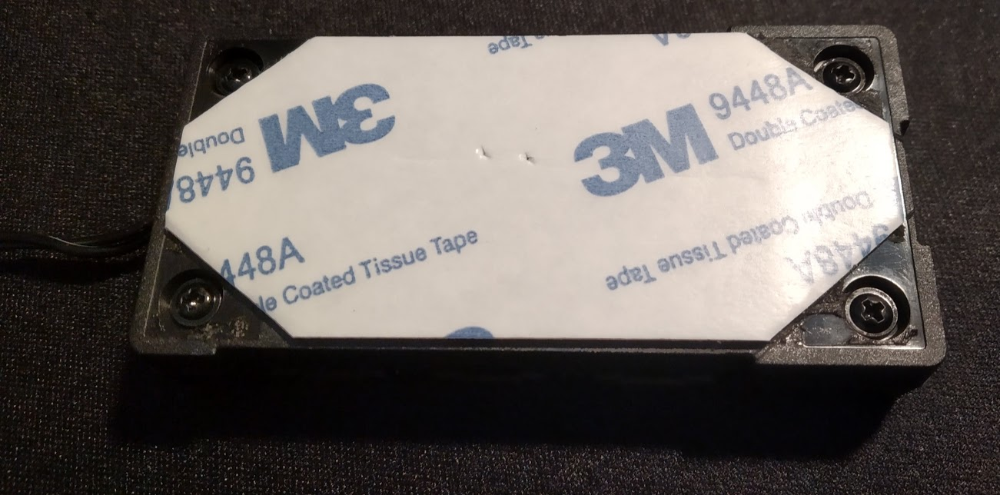
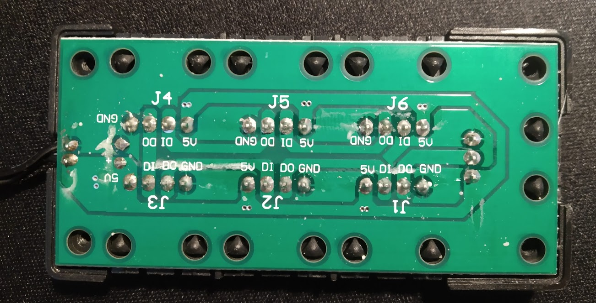
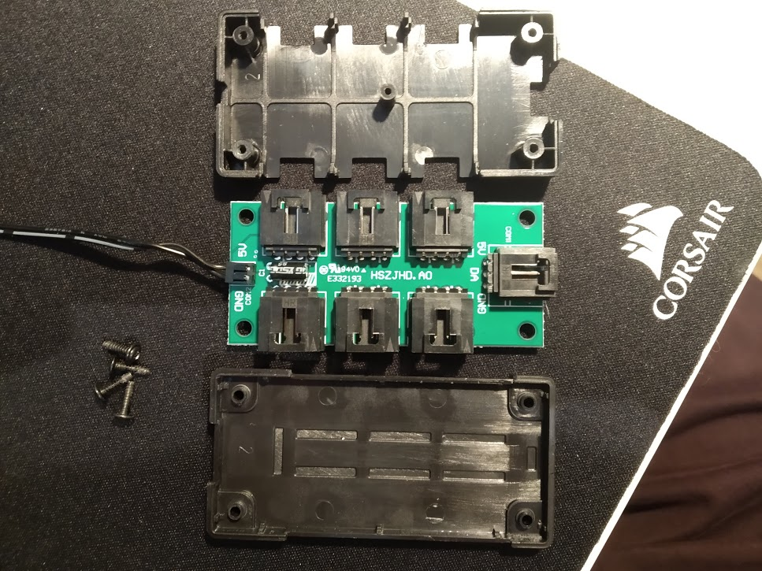
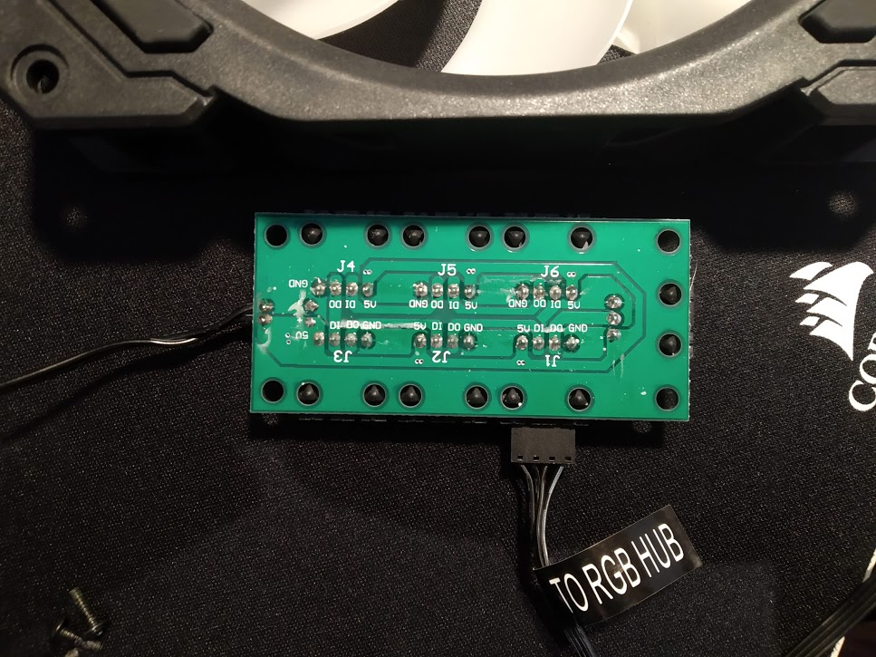
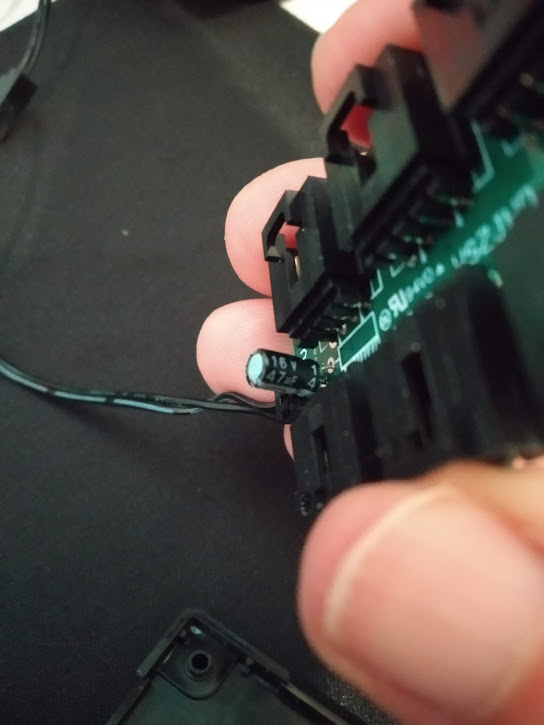

# Corsair RGB Fan LED Hub

Here are a few photos of the disassembly of a Corsair RGB Fan LED Hub.
You should be able to determine all the pinouts from the included photos.

There are four black phillips head screws under the sticker pad on the back side of the hub.
This particular PCB has the markings E332193 and HSZJHD.AO.
It has one 16v 47uf capacitor from the SATA power +5v to GND.

The data input pin from the Lighting Node PRO is connected to the data-in pin for RGBFAN1.
The RGBFAN1 data-out pin is connected directly to the RGBFAN2 data-in pin.
The RGBFAN6 data-out pin is not connected to anything.

